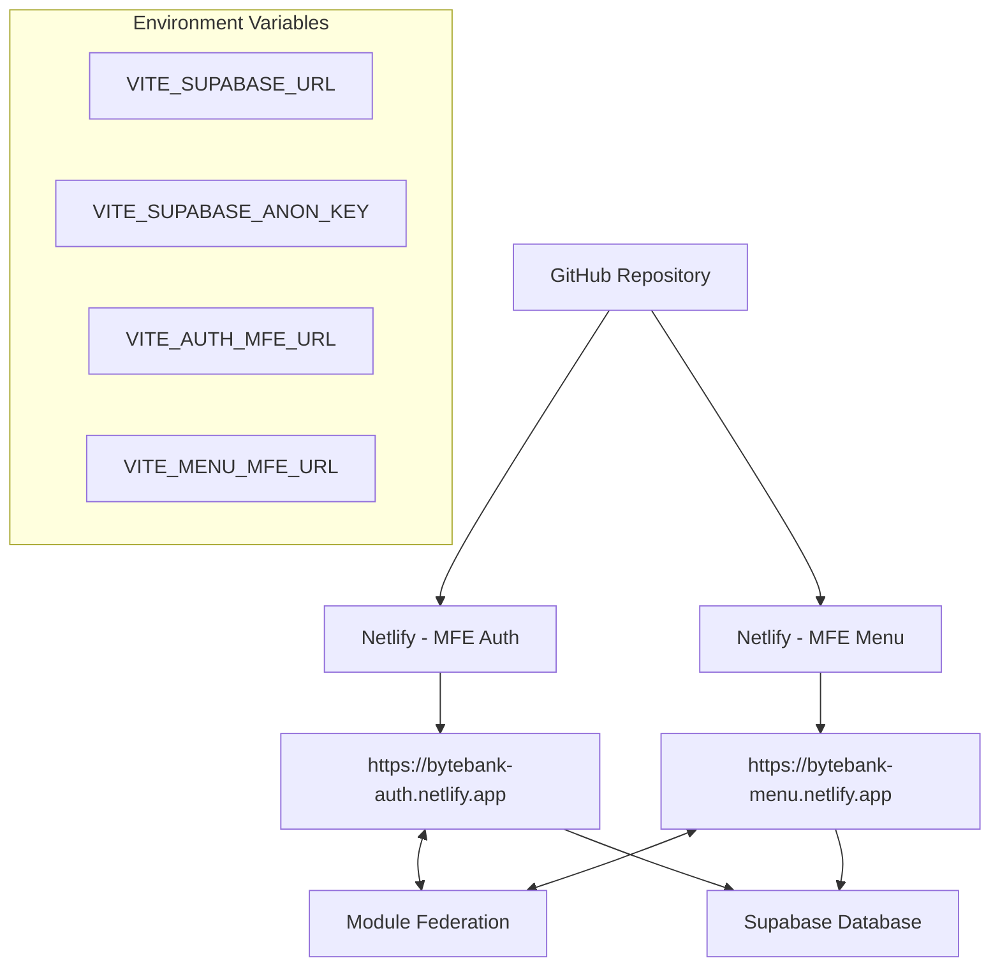

# 📁 Estrutura Final do Projeto - Deploy Ready

```
ByteBank-TurboRepo/
├── 📋 DEPLOY.md                    # Documentação completa de deploy
├── 🚀 DEPLOY-QUICK.md             # Guia rápido de deploy
├── 🔧 .env.example                # Template de variáveis de ambiente
├── 📝 README.md                   # Documentação do projeto
├── 📦 package.json                # Scripts principais do monorepo
├── ⚙️ turbo.json                  # Configuração do Turbo
├── 🔒 pnpm-lock.yaml             # Lock file das dependências
│
├── 🎯 apps/
│   ├── 🔐 mfe-auth/              # Microfrontend de Autenticação
│   │   ├── 🐳 Dockerfile          # Docker multi-stage para produção
│   │   ├── 🌐 netlify.toml        # Configuração Netlify com CORS
│   │   ├── ⚙️ vite.config.ts      # Vite + Module Federation
│   │   ├── 📦 package.json        # Scripts incluindo build:netlify
│   │   ├── 🖥️ nginx.conf          # Nginx para Docker
│   │   └── 📁 src/                # Código fonte
│   │
│   └── 📊 mfe-menu/              # Microfrontend Dashboard/Menu
│       ├── 🐳 Dockerfile          # Docker multi-stage para produção
│       ├── 🌐 netlify.toml        # Configuração Netlify com CORS
│       ├── ⚙️ vite.config.ts      # Vite + Module Federation
│       ├── 📦 package.json        # Scripts incluindo build:netlify
│       ├── 🖥️ nginx.conf          # Nginx para Docker
│       └── 📁 src/                # Código fonte
│
└── 📚 packages/
    ├── 🌍 env/                    # Environment Variables (atualizado)
    │   ├── 📄 src/client.ts       # Validação de envs com Zod
    │   └── 📦 package.json        # Dependências do sistema de envs
    │
    ├── 🎨 ui/                     # Componentes UI compartilhados
    ├── 🔍 eslint-config/          # Configuração ESLint
    └── 📝 typescript-config/      # Configuração TypeScript
```

## 🏗️ Arquitetura de Deploy



## ✅ Checklist de Deploy

### Pré-Deploy
- [x] Environment variables configuradas no pacote @bytebank/env
- [x] Vite configs atualizados para produção
- [x] Dockerfiles criados e testados
- [x] netlify.toml configurados com CORS
- [x] Build scripts criados para Netlify
- [x] Build testado e funcionando

### Durante o Deploy
- [ ] Site 1: bytebank-auth no Netlify
- [ ] Site 2: bytebank-menu no Netlify
- [ ] Environment variables configuradas em ambos sites
- [ ] URLs reais atualizadas nas variáveis

### Pós-Deploy
- [ ] remoteEntry.js acessível em ambos sites
- [ ] Module Federation funcionando
- [ ] Console sem erros de CORS
- [ ] Navegação entre rotas funcionando
- [ ] Conexão com Supabase ativa
- [ ] Autenticação funcionando

## 🎯 URLs Esperadas

- **Auth MFE**: `https://bytebank-auth.netlify.app`
- **Menu MFE**: `https://bytebank-menu.netlify.app`
- **Remote Entries**:
  - `https://bytebank-auth.netlify.app/remoteEntry.js`
  - `https://bytebank-menu.netlify.app/remoteEntry.js`

---
**🚀 Projeto 100% configurado para deploy no Netlify!**
